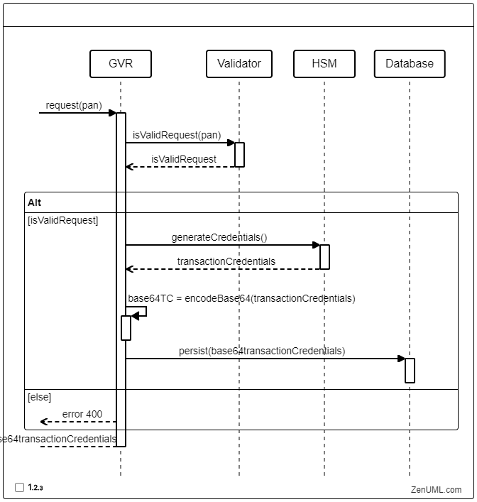

# Distributed system to generate and validate transaction credentials for eCommerce

Solution for the proposed design problem

## Logical Diagram


- There's a common database for every region with PCI related data and a a transaction counter table.
- The generate component has a cache containing the PCI related data relative to the region where it resides.
- The validate's component cache, besides the PCI related data has the not yet validated transaction's counter, held for the validity's lifespan.

## Sequence diagrams
#### Generate

#### Validate

## Swagger specification
- [eComTransactionCredentials.yaml](doc/swagger/eComTransactionCredentials.yaml)

## Data Model


```sql
CREATE TABLE "card_holder"
(
    "id"            long PRIMARY KEY,
    "pan"           varchar(16),
    "expiricy_date" timestamp
);

CREATE TABLE "transaction"
(
    "id"          long PRIMARY KEY,
    "credentials" varchar(100),
    "amount"      numeric,
    "merchant"    varchar(256),
    "pan"         long
);

CREATE TABLE "transaction_counter"
(
    "id"          long PRIMARY KEY,
    "transaction" long,
    "issued"      boolean
);

CREATE UNIQUE INDEX ON "card_holder" ("pan");

CREATE UNIQUE INDEX ON "transaction" ("credentials");

CREATE INDEX ON "transaction_counter" ("transaction", "issued");

ALTER TABLE "transaction"
    ADD FOREIGN KEY ("pan") REFERENCES "card_holder" ("id");

ALTER TABLE "transaction"
    ADD FOREIGN KEY ("id") REFERENCES "transaction_counter" ("transaction");
```
